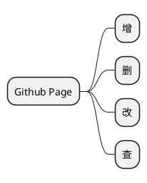

#### Hello World!

---

---



```bash
# local shell
git checkout -b dev-feature
git add <changed_file>
git commit -m "Update commit message"
git push origin dev-feature
git checkout master
git pull origin master
git checkout dev-feature
git rebase master
git push -f origin dev-feature

# remote repository
New pull request
Squash and merge
delete branch

# local shell
git checkout master
git branch -D dev-feature
git pull origin master
```

```bash
# local shell
git checkout -b dev-feature
git add <changed_file>
git commit -m "Update commit message"
git checkout master
git pull origin master
git checkout dev-feature
git rebase master
git push origin dev-feature

# remote repository
New pull request
Squash and merge
Delete branch

# local shell
git checkout master
git branch -D dev-feature
git pull origin master
```

---

> My projects for Github.

- [Demo: Getting Started -- C++](https://github.com/All-things-equal/Fast_Getting_Started_C-Plus-Plus)

- [Demo: Getting Started -- data structure](https://github.com/All-things-equal/Getting_Started_Data-Structure)

- [Demo: STC89C52RC -- Modules Example](https://github.com/All-things-equal/STC89C52RC_Modules_TestExample)

---

> /_ ------ END ------ _/
