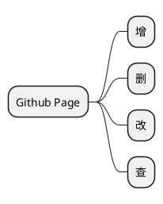

#### Hello World!

---
---

---

> My projects for Github.

- [Demo: Getting Started -- C++](https://github.com/All-things-equal/Fast_Getting_Started_C-Plus-Plus)
- [Demo: Getting Started -- data structure](https://github.com/All-things-equal/Getting_Started_Data-structure)
***
***
> /* ------ END ------ */
